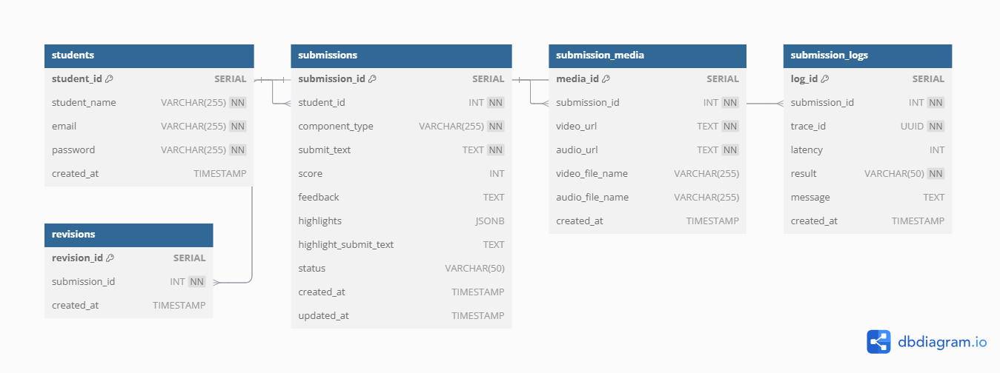

# submission-evaluation-api

- AI 학습 평가 기능을 제공하는 REST API
- 학생이 제출한 영어 에세이를 AI 모델을 통해 자동 평가하고, 점수 및 피드백을 제공
- 영상 전처리, 평가 이력 로깅, 통계 수집 등 다양한 기능을 포함

---

## 주요 기능

- 에세이 제출 및 평가 요청(텍스트 + 영상)
- Azure OpenAI API를 활용한 점수, 피드백, 하이라이트 추출
- 영상 전처리(우측 이미지 제거 + 음성 분리) -> Azure Blob Storage 업로드
- 평가 결과 하이라이트 텍스트 가공(`<b>` 태그 적용)
- 제출 결과 목록/상세 조회
- 재평가 요청 및 이력 관리
- 평가 로그 저장, 통계 집계 스케줄러
- Swagger 기반 API 문서 제공

---

## 기술 스택

| 항목             | 사용 기술              |
| :--------------- | :--------------------- |
| Framework        | NestJS 10+, TypeScript |
| Database         | PostgreSQL + TypeORM   |
| AI Evaluation    | Azure OpenAI Service   |
| File Storage     | Azure Blob Storage     |
| Video Processing | FFmpeg (fluent-ffmpeg) |
| API Docs         | Swagger (OpenAPI)      |

---

## 📘 ERD (Entity Relationship Diagram)



ERD는 dbdiagram.io에서 작성했으며, 실제 테이블 생성 스크립트는 아래의 DDL 또는 TypeORM 마이그레이션으로 구성되어 있습니다.

---

## 실행 방법

1. 프로젝트 클론

```bash
git clone https://github.com/yoonsoo7429/submission-evaluation-api.git
cd submission-evaluation-api
```

2. 의존성 설치

```bash
npm install
```

3. 환경변수 설정

- .env 파일이 필요합니다.
- 기본 예시는 .env.example 파일에 제공되어 있습니다.
- .env.example 파일을 복사해서 .env 파일을 생성한 뒤 내용을 채워주세요.

4. 서버 실행

```bash
npm run start:dev
```

5. API 문서(Swagger) 접속

```bash
http://localhost/swagger
```

- API의 실제 경로는 /v1/ prefix가 붙습니다. (예시: http://localhost/v1/submission)
- Swagger 문서에서는 Bearer 토큰(JWT)을 인증 후 테스트할 수 있습니다.
- 모든 요청은 JWT 토큰이 필요합니다.(로그인, 가입 API 제외)
